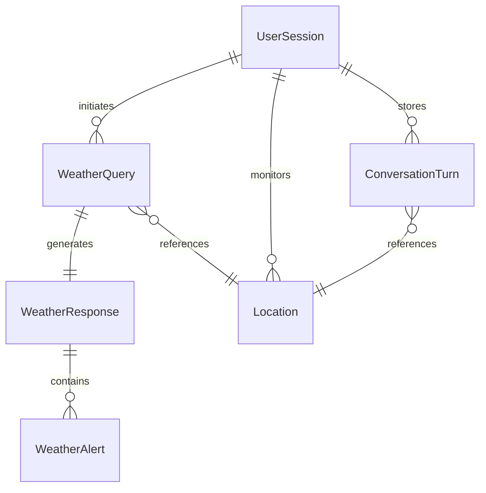

# Data Model: Cloud-Native Weather Agent

## Core Entities

### WeatherQuery
**Description**: Natural language question about weather with context

**Fields**:
- `id`: UUID (primary key)
- `user_id`: String (foreign key to User)
- `session_id`: String (links to UserSession)
- `query_text`: String (max 500 chars)
- `location_context`: Optional[Location] (extracted or inferred)
- `temporal_context`: Optional[String] (today, tomorrow, next week)
- `timestamp`: DateTime (ISO 8601)
- `processing_time_ms`: Integer

**Validation Rules**:
- query_text must be non-empty
- query_text must not contain PII
- timestamp must be in UTC

**State Transitions**: None (immutable once created)

### WeatherResponse
**Description**: Structured weather information returned to user

**Fields**:
- `id`: UUID (primary key)
- `query_id`: UUID (foreign key to WeatherQuery)
- `weather_data`: JSON (structured weather info)
- `temperature_unit`: Enum[Celsius, Fahrenheit]
- `data_source`: String (MCP server identifier)
- `freshness_timestamp`: DateTime (when data was fetched)
- `cache_hit`: Boolean
- `alerts`: List[WeatherAlert] (if any)

**Validation Rules**:
- weather_data must conform to schema
- freshness_timestamp must be within 15 minutes of current time if not cached
- temperature_unit defaults to Fahrenheit

**State Transitions**: None (immutable once created)

### UserSession
**Description**: Authenticated user context with conversation history

**Fields**:
- `id`: UUID (primary key)
- `user_id`: String (from OAuth2 token)
- `session_token`: String (unique, indexed)
- `preferences`: JSON
  - `temperature_unit`: Enum[Celsius, Fahrenheit]
  - `default_location`: Optional[Location]
- `monitored_locations`: List[Location] (max 3)
- `conversation_history`: List[ConversationTurn]
- `created_at`: DateTime
- `last_activity`: DateTime
- `expires_at`: DateTime (last_activity + 30 minutes)

**Validation Rules**:
- monitored_locations max length is 3
- expires_at automatically set on activity
- session_token must be cryptographically secure

**State Transitions**:
- Active → Expired (after 30 minutes inactivity)
- Active → Active (on new activity, updates last_activity)

### Location
**Description**: Geographic reference for weather queries

**Fields**:
- `id`: UUID (primary key)
- `display_name`: String (user-friendly name)
- `latitude`: Float (-90 to 90)
- `longitude`: Float (-180 to 180)
- `city`: Optional[String]
- `state_province`: Optional[String]
- `country`: String (ISO 3166-1 alpha-2)
- `postal_code`: Optional[String]
- `timezone`: String (IANA timezone)

**Validation Rules**:
- latitude/longitude must be valid coordinates
- country must be valid ISO code
- At least one of (lat/lon) OR (city + country) must be present

**State Transitions**: None (immutable once created)

### WeatherAlert
**Description**: Severe weather notification

**Fields**:
- `id`: UUID (primary key)
- `external_id`: String (from weather provider)
- `severity`: Enum[Moderate, Severe, Extreme]
- `headline`: String
- `description`: Text
- `affected_area`: Location
- `effective_from`: DateTime
- `expires_at`: DateTime
- `source`: String (weather service name)

**Validation Rules**:
- Only Severe and Extreme trigger notifications
- expires_at must be after effective_from
- external_id must be unique per source

**State Transitions**:
- Pending → Active (when effective_from reached)
- Active → Expired (when expires_at reached)

### UsageMetrics
**Description**: System performance and usage tracking

**Fields**:
- `id`: UUID (primary key)
- `timestamp`: DateTime (minute granularity)
- `request_count`: Integer
- `error_count`: Integer
- `cache_hit_count`: Integer
- `avg_response_time_ms`: Float
- `p95_response_time_ms`: Float
- `active_sessions`: Integer
- `rate_limit_hits`: Integer

**Validation Rules**:
- All counts must be non-negative
- timestamp rounded to minute

**State Transitions**: None (append-only time series)

### ConversationTurn
**Description**: Single exchange in conversation history

**Fields**:
- `user_query`: String
- `assistant_response`: String
- `timestamp`: DateTime
- `location_context`: Optional[Location]

**Validation Rules**:
- Both query and response required
- Stored in session conversation_history list

## Relationships

## Storage Strategy

### Redis Keys
- Session: `session:{user_id}:{session_id}` (TTL: 30 minutes)
- Cache: `cache:weather:{location_hash}:{metric}` (TTL: 15 minutes)
- Rate Limit: `ratelimit:{user_id}` (TTL: 1 minute sliding window)

### Persistent Storage
- UsageMetrics: Time-series database or PostgreSQL with partitioning
- WeatherQuery/Response: PostgreSQL for audit trail (1 day retention)

## Data Privacy
- No PII stored in query text
- User IDs from OAuth2 tokens (no personal info)
- Queries anonymized after 1 day
- No correlation between sessions after expiry